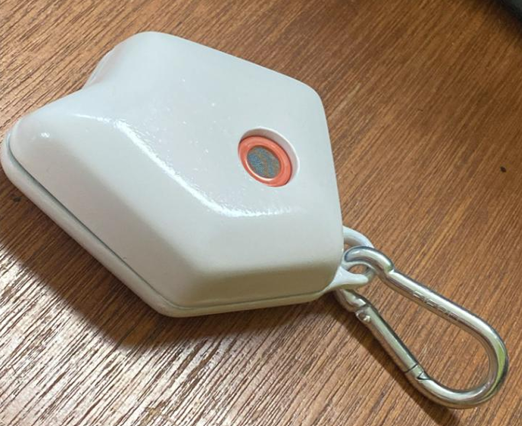

# 🍺 Proyecto: Alcoholímetro Wearable (AlcoSense)

## Resumen del Proyecto
El AlcoSense es un dispositivo digital wearable diseñado para monitorear en tiempo real los niveles de alcohol, pulso y oxigenación en el cuerpo, buscando mejorar la seguridad vial y la concientización del usuario. 

El dispositivo utiliza un ESP32 para controlar los componentes físicos y alojar un servidor web asíncrono para visualizar mediciones en tiempo real, guardar historial localmente y clasificar el riesgo.

## 💻 Hardware y Componentes

| Componente | Conexión/ Tecnología| Función Principal |
| :--- | :---: | :--- |
| **ESP32 DevKitC** | Microcontrolador | Utilizado por su capacidad Wi-Fi  y alto rendimiento |
| **MQ3** | ADC(Analógico) | Sensor de Gas Alcohol |
| **MAX30102** | I2C | Pulsímetro y Oxímetro|
| **Batería de Litio (250 mAh)** |  | Autonomía para el uso portable |
| **TP4056** |  | Módulo de carga y descarga de batería |

## 🚀 Instrucciones de Uso (Flujo de Trabajo)
1.  Encender el dispositivo y mantener el dispositivo en aire limpio por 15 segundos para calibrar el sensor.
2.  Conectarse a la red en la que se encentra el dispositivo y acceder al servidor `web http://alcoholimetro.local`
3.  Presionar el boton `Iniciar Medición`
4.  Colocar el dedo en el sensor MAX30102 y soplar brevemente sobre el sensor MQ-3 por 5 segundos.
5.  Una vez completada la medición, presionar `Volver` para guardar los datos en el historial local del navegador.
   
## ⚙️ Características de la Programación

* **Algoritmo de Alcohol (MQ-3):** Implementación de la calibración de la resistencia del sensor en aire limpio (*R0*) y el cálculo de la concentración de alcohol (*mg/L*) utilizando la relación (*Rs/R0*) simplificando mediante Mapeo Lineal.

* **Almacenamiento Local:** Las mediciones completadas se guardan en el localStorage del navegador (caché) para mantener un historial.

* **Clasificación de Riesgo**: El código JS clasifica el nivel de riesgo ("Bajo", "Medio", "Alto") basándose en el valor de alcohol medido y la tabla de resultados de alcoholemia BrAC/BAC.

* **Comunicación Cliente-Servidor Asíncrona:** El botón `Iniciar Medición` envía una petición GET a `/iniciar_medicion` para indicarle al ESP32 que comience a leer los sensores. El cliente utiliza la función `startPollingForData()` para consultar repetidamente el estado y los datos finales mediante   `fetch('/obtener_datos')`.

## 🖼️ Montaje

